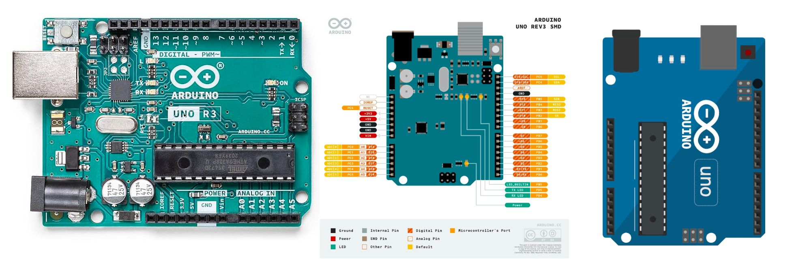

# Robot Sumo


[](https://github.com/arduino/arduino-ide/actions?query=workflow%3A%22Arduino+IDE%22)


# Nivel de dificultad: Básico

Un robot de sumo con Arduino básico es un proyecto interesante y divertido que involucra la construcción de un pequeño robot diseñado para competir en combates de sumo.

Los robots de sumo suelen ser pequeños y compactos, diseñados para ser lo más efectivos posible en términos de potencia, velocidad y estrategia

Aquí tienes los pasos básicos para crear un robot de sumo con Arduino:

# Lista de materiales:
* ***Chasis con 2 o 4 Motor Reductor de Doble Eje Tipo I, 200RPM, 3-6V.***

* ***Arduino Uno REV3 y su IDE.***

* ***Puente H L298N o Mini L298N.***

* ***HC-SR04 Ultrasonico.***

* ***TCRT5000 Optico Infrarrojo.***

* ***Lipo Batería 7,4 V 1500 MAh y su cargador.***

* ***Cautín, Estaño, pasta flux, Cables de conexión, Mini Protoboard.***

Considerar silicon caliente, cinta doble cara para ancleje.
* ***Computadora.***


# Diseño de un chasis o armado de uno prefabricado
El chasis es el componente estructural del robot que contiene el tren motriz y permite que el robot sea móvil mediante el uso de ruedas, huellas de tanque u otro método. En ocasiones, un chasis se denomina estructura del robot. El chasis también proporciona una estructura para sujetar manipuladores como brazos, garras, elevadores, arados, sistemas de transporte, tomas de objetos y otras características de diseño utilizadas para manipular objetos. 

Comienza por diseñar y construir un chasis resistente y compacto para tu robot de sumo. Ten en cuenta el espacio reducido disponible para colocar todos los componentes.

Utiliza materiales ligeros pero duraderos, como plástico o aluminio, para construir el chasis. Asegúrate de que sea lo suficientemente robusto para soportar los movimientos y colisiones durante las competencias.


# Ensamblaje de los componentes
## ***Integrando Arduino UNO, Puente H, Motoreductores***

<hr>
* Conecta el Arduino Uno al puente H L298N y este a su vez a los motores, esto permitirá controlar los motores del robot.

***Circuit Diagram***


***Si estas utilizando el Mini puente H, verifica la conexión***


<hr>

***Arduino Code***

```cpp

int in1=13,in2=12,in3=11,in4=10;
int enable1=6,enable2=5;

//El programa hace que las ruedas se muevan hacia atras y adelante
void setup()
{
 pinMode(in1,OUTPUT);
pinMode(in2,OUTPUT);
pinMode(in3,OUTPUT);
pinMode(in4,OUTPUT);
analogWrite(enable1, 255);
analogWrite(enable2, 255);
}
void loop()
{
 
 digitalWrite(in2, HIGH);
 digitalWrite(in1, LOW);
 digitalWrite(in3, HIGH);
 digitalWrite(in4, LOW);
 delay(5000);
 digitalWrite(in2, LOW);
digitalWrite(in1, LOW);
 digitalWrite(in3, LOW);
digitalWrite(in4, LOW);
delay(1000);
}

```

#### PROGRAMACIÓN
* Conecta el sensor TCRT5000 y el HC-SR04 al Arduino Uno. Estos sensores serán responsables de detectar el borde del ring y al oponente, respectivamente.

* Conecta el módulo de baterías y el regulador de voltaje para asegurar un suministro de energía constante y estable.

## Simuladores
 

* [Wokwi](https://wokwi.com/)


* [Tinkercad](https://www.tinkercad.com/)


